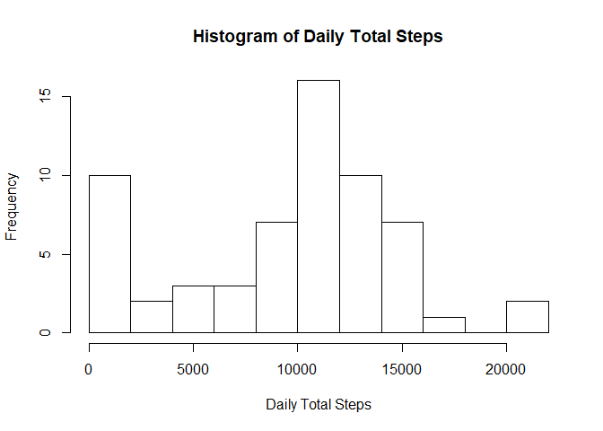
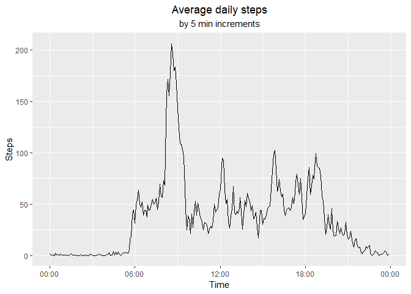
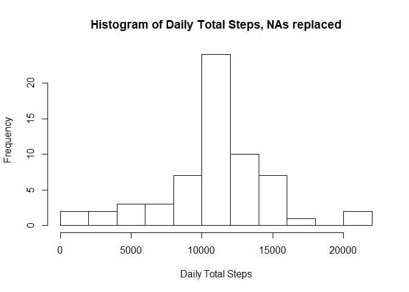
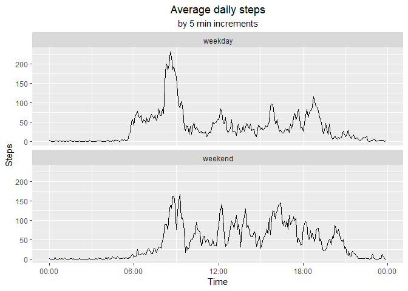

## Loading and preprocessing the data

I like using tidyverse, so I have loaded that and then performed a standard unzip and
read_csv to load the activity data into the activity variable.  


```r
library(tidyverse)
```

```
## -- Attaching packages ------------------------------------------------------ tidyverse 1.2.1 --
```

```
## v ggplot2 3.1.0     v purrr   0.2.5
## v tibble  1.4.2     v dplyr   0.7.8
## v tidyr   0.8.2     v stringr 1.3.1
## v readr   1.3.1     v forcats 0.3.0
```

```
## -- Conflicts --------------------------------------------------------- tidyverse_conflicts() --
## x dplyr::filter() masks stats::filter()
## x dplyr::lag()    masks stats::lag()
```

```r
library(lubridate)
```

```
## 
## Attaching package: 'lubridate'
```

```
## The following object is masked from 'package:base':
## 
##     date
```

```r
unzip("activity.zip")
activity <- read_csv("activity.csv",
                     col_types = cols(
                         steps = col_double(),
                         date = col_date(format = "%F"),
                         interval = col_double()
                     ))
```

The interval is supposed to represent the time, measured in 5 minute increments,
but by dropping leading zeros and hour and minute separators you have sequential
values like ..., 50, 55, 100, 105, ... . To fix this I converted the interval to
a character string, appended "000" and took the last four character, making each
interval a 4-character string. This can be easily split with strptime, et al
using the format %H%M.


```r
activity$interval <- paste0("000",as.character(activity$interval))
activity$interval <- with(activity, substr(interval, nchar(interval) - 3,
                                           nchar(interval)))
```

## What is mean total number of steps taken per day?

These data can be grouped by date and summarized to find the sum of the steps 
per day.    


```r
daily_steps <- activity %>% 
    group_by(date) %>% summarize("Total"=sum(steps, na.rm = TRUE))
```

This summary information can then be used to make a histogram. 15 breaks were
chosen for no particular reason, but gives a better sense of the shape of the
distribution.


```r
hist(daily_steps$Total, breaks = 15,
     main = "Histogram of Daily Total Steps",
     xlab = "Daily Total Steps")
```

<!-- -->


```r
total_summary <- summary(daily_steps$Total)
```

The mean value is 9354 and the median is 10395.

## What is the average daily activity pattern?

The average daily pattern can be found by regrouping the tibble by interval and 
then summarizing an average value for each chunk of time. The interval is
then converted to a date-time object


```r
daily_pattern <- activity %>%
    group_by(interval) %>% summarize("Average"=mean(steps, na.rm = TRUE))

daily_max <- filter(daily_pattern, Average == max(Average))

daily_pattern$interval <- as_datetime(daily_pattern$interval, tz = "UTC", format = "%H%M")
ungroup(daily_pattern)
```

```
## # A tibble: 288 x 2
##    interval            Average
##    <S3: POSIXlt>         <dbl>
##  1 2019-01-12 00:00:00  1.72  
##  2 2019-01-12 00:05:00  0.340 
##  3 2019-01-12 00:10:00  0.132 
##  4 2019-01-12 00:15:00  0.151 
##  5 2019-01-12 00:20:00  0.0755
##  6 2019-01-12 00:25:00  2.09  
##  7 2019-01-12 00:30:00  0.528 
##  8 2019-01-12 00:35:00  0.868 
##  9 2019-01-12 00:40:00  0     
## 10 2019-01-12 00:45:00  1.47  
## # ... with 278 more rows
```

```r
ggplot(daily_pattern) +
    geom_line(mapping = aes(as.POSIXct.POSIXlt(interval), Average, group = 1)) +
    scale_x_datetime(date_label = "%H:%M") +
    labs(title = "Average daily steps",
         subtitle = "by 5 min increments",
         x = "Time",
         y = "Steps") +
    theme(plot.title = element_text(hjust = 0.5),
          plot.subtitle = element_text(hjust = 0.5))
```

<!-- -->

Using filter(), we can pull the entry that has the highest value, 206 steps, at interval 08:35.

## Imputing missing values

While the date-time version of the interval was useful in properly displaying it
I will be better served by using the character version, so I recalculated
daily_pattern.


```r
daily_pattern <- activity %>%
    group_by(interval) %>% summarize("Average"=mean(steps, na.rm = TRUE))
```

Next, I made a data.frame of all of the rows with NA in activity (called
activity.na) and then merged that table with daily_pattern and then loaded that
into a copy of activity called act.


```r
activity.na <- activity[is.na(activity$steps),]
activity.na <- merge(activity.na, daily_pattern, by = "interval") %>%
    arrange(date, interval)
act <- activity
act[is.na(act$steps),]$steps <- activity.na$Average
```

Using act I generated a new histogram using the method from the first question
along with calculating a mean and median for the filled in data.


```r
daily_steps2 <- act %>% 
    group_by(date) %>% summarize("Total"=sum(steps))
hist(daily_steps2$Total, breaks = 15,
     main = "Histogram of Daily Total Steps, NAs replaced",
     xlab = "Daily Total Steps")
```

<!-- -->


```r
total_summary2 <- summary(daily_steps2$Total)
```

The mean value is 10766
and the median is 10766.  

Imputing the missing values with the average daily value caused the mean and
median daily total values to increase. This should be expected, as both
histograms look at the total daily steps and any missing values now add to that
total. This can most easily be seen with the 10 values in the lowest bin in the
first histogram shifting to only 2 values in the same bin in the second
histogram. Overall, the left half of the first histogram shifted to the mean in
the second histogram, which is responsible for commensurate shifts in median and
mean.

## Are there differences in activity patterns between weekdays and weekends?


```r
act$weekend <- ifelse(wday(activity$date) %in% c(1, 7), "weekend", "weekday")
weekend_pattern <- act %>%
    group_by(interval, weekend) %>%
    summarize("Average"=mean(steps)) %>%
    ungroup()
weekend_pattern$interval <- as_datetime(weekend_pattern$interval,
                                        tz = "UTC",
                                        format = "%H%M")
ggplot(weekend_pattern) +
    geom_line(mapping = aes(as.POSIXct.POSIXlt(interval), Average, group = weekend)) +
    scale_x_datetime(date_label = "%H:%M") +
    labs(title = "Average daily steps",
         subtitle = "by 5 min increments",
         x = "Time",
         y = "Steps") +
    theme(plot.title = element_text(hjust = 0.5),
          plot.subtitle = element_text(hjust = 0.5)) +
    facet_wrap(~ weekend, nrow = 2)
```

<!-- -->
